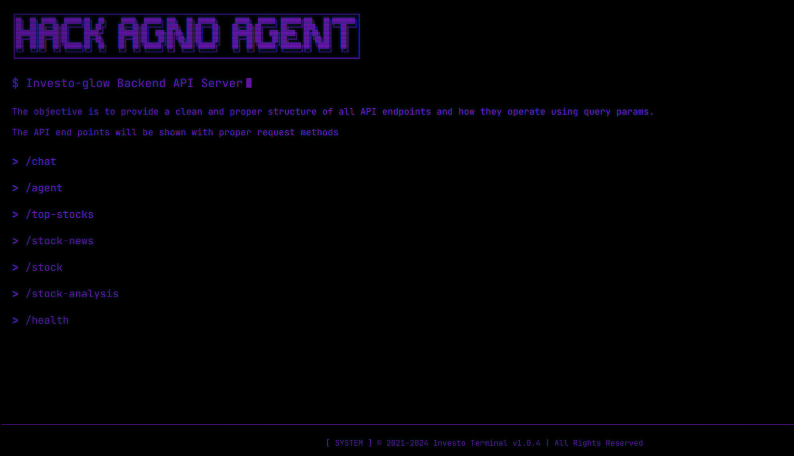

---
[](https://wakatime.com/badge/user/9a827e04-5df8-4525-ace8-e88326bbf87a/project/ae998970-e02b-47a4-acbe-a48650c8551f) [](https://www.youtube.com/watch?v=9jkqToUvmZ4)

---

> [!NOTE]
> Main Backend server hosted on Render. It is a REST API server built using **[FastAPI](https://fastapi.tiangolo.com/)** and **[Agno](https://docs.agno.com/introduction)**. It is hosted on Render. 
> The server is responsible for handling all the requests from the frontend and processing them. 
> It also interacts with the Agno AI to get the predictions for the stock prices.

<iframe 
    width="100%" 
    height="480" 
    src="https://youtu.be/Ewnsmr99NJY" 
    frameborder="0" 
    allow="accelerometer; autoplay; clipboard-write; encrypted-media; gyroscope; picture-in-picture" 
    allowfullscreen>
</iframe>

## Deployment

The backend server can be locally deployed using Docker. Use the following command to build and run the server:

- **Build the Docker image**
```bash 
docker-compose build
```

- **Run the Docker container**
```bash
docker-compose up
```

- **Access the server**
```bash
http://localhost:8000/
```

### API Documentation
The API documentation is available at the following URL:

```bash
http://localhost:8000/docs
```
This documentation provides a detailed overview of all the available endpoints, including their request and response formats. You can also test the endpoints directly from the documentation.

## Test the API
You can test the API using Postman or any other API testing tool. The following endpoints are available:

- /chat
- /agent
- /stock
- /stock-analysis
- /stock-news
- /top-stocks

## Tech Stack

<table>
    <tr>
        <td></td>
        <td>FastAPI is a modern, fast (high-performance), web framework for building APIs with Python 3.6+ based on standard Python type hints.</td>
    </tr>
    <tr>
        <td></td>
        <td>Agno is a lightweight library for building multi-modal Agents.
</td>
    </tr>
    <tr>
        <td></td>
        <td>Render is a cloud provider that makes deploying your code as easy as deploying to localhost. You can deploy anything that runs on a single port.</td>
    </tr>
    <tr>
        <td></td>
        <td>Docker is a set of platform as a service products that use OS-level virtualization to deliver software in packages called containers</td>
    </tr>
    <tr>
        <td></td>
        <td>Redis is a free, open-source, in-memory database that stores data as key-value pairs. It's often used as a cache, message broker, or database for quick responses.</td>
    </tr>
</table>

---

<a href="https://github.com/yashksaini-coder">
    <table>
        <tbody>
            <tr>
                <td align="left" valign="top" width="14.28%">
                    
                    <br/>
                    <h4 align="center">
                        <b>Yash K. Saini</b>
                    </h4>
                    <div align="center">
                        <p>(Author)</p>
                    </div>
                </td>
                <td align="left" valign="top" width="85%">
                    <p>
                        👋 Hi there! I'm <u><em><strong>Yash K. Saini</strong></em></u>, a self-taught software developer and a computer science student from India.
                    </p>
                    <ul>
                     <li>
                        I love building & contributing to Open Source software solutions & projects that help solve real-world problems.
                    </li>
                    <li>
                        I want to build products & systems that can benefit & solve problems for many other DEVs.
                    </li>
                </td>
            </tr>
        </tbody>
    </table>
</a>

<p align="center">
    <strong>🌟 If you find this project helpful, please give it a star on GitHub! 🌟</strong>
</p>
